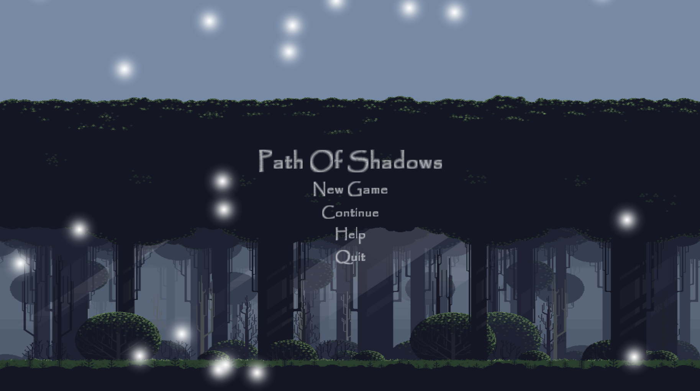
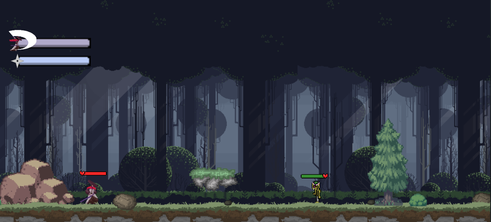

# 🗡️ PathOfShadows

**Un juego de acción y plataformas 2D** donde un samurái solitario debe sobrevivir en un mundo oscuro lleno de zombies de hielo, lobos salvajes y trampas mortales.

## 🎮 Descripción

PathOfShadows es un juego de acción 2D con combates fluidos, animaciones detalladas y dos niveles completos. Controla a un samurái que utiliza espada, shuriken y habilidades especiales para abrirse paso a través de hordas de enemigos y llegar al final de cada nivel.

## ✨ Características

- **Combate dinámico**: Ataques con espada, shuriken y dash especial
- **Enemigos variados**: Zombies de hielo, lobos, jefe Ice Zombie King y más
- **2 niveles completos** con portales, plataformas móviles y trampas
- **Animaciones fluidas** de idle, run, attack, jump, death y más
- **Sistema de vida** con corazones y barra de salud
- **Audio inmersivo** con música de fondo y efectos de sonido
- **Mecánicas extra**: Portales, explosiones, monedas y power-ups

## 🕹️ Controles

| Acción          | Tecla          |
|-----------------|----------------|
| Moverse         | WASD / Flechas |
| Saltar          | Espacio        |
| Atacar          | Click izquierdo / J |
| Shuriken        | Click derecho  |
| Dash / Habilidad| Shift          |

## 📸 Capturas de pantalla

**Pantalla de inicio**

**Gameplay - Nivel 1**

**Combate contra enemigos**

**Nivel 2 - Boss fight**

## 🛠️ Tecnologías

- **Motor**: Unity (2D)
- **Lenguaje**: C#
- **Arte**: Sprites y animaciones propias
- **Audio**: Efectos de sonido y música original

## ▶️ Cómo jugar

### Opción 1 - Ejecutable (recomendado)
1. Descarga la última build desde la carpeta `Samurai_Data` o compila el proyecto.
2. Ejecuta `Samurai Rendition.exe`

### Opción 2 - Desde Unity
1. Abre el proyecto en Unity
2. Ve a `File > Build Settings`
3. Añade las escenas: `StartScene`, `Level1`, `Level2`, `StoryBreak1`, `StoryBreak2`
4. Build & Run

## 📦 Estructura del proyecto
